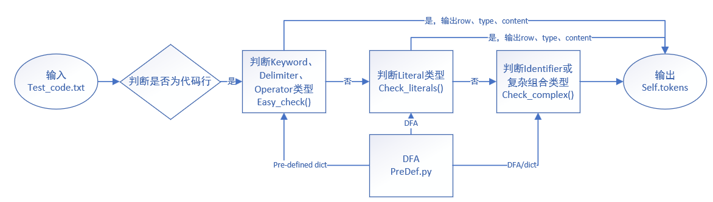
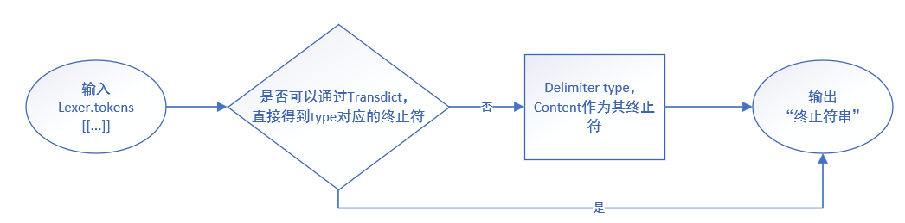
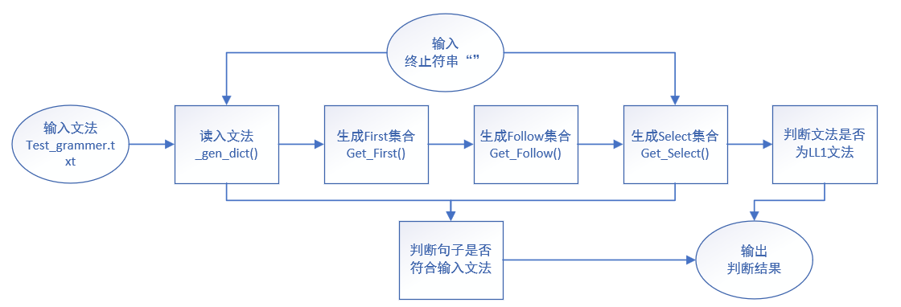
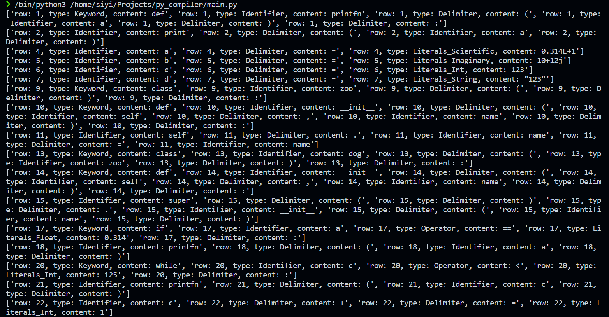
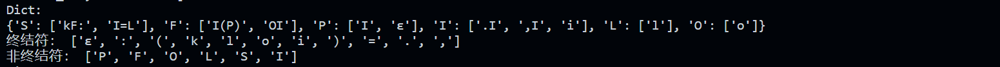
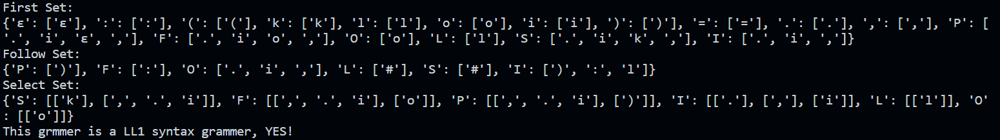
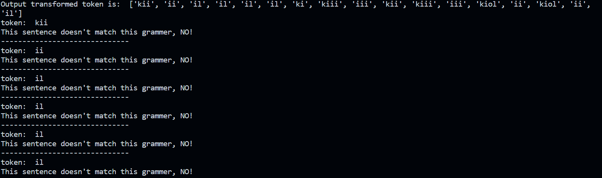

# 软件课程设计2 课设报告
919102610102 黄思怡

## 1 实验目的
- 使用 DFA 创建词法分析器。
词法分析程序有两个输入：一个文本文档，包括一组 3 型文法（正规文法）的产生式；一个源代码文本文档，包含一组需要识别的字符串（程序代码）。程序的输出是一个 token（令牌）表，该表由 5 种 token 组成：关键词，标识符，常量，限定符和运算符。

- 创建 LL(1) 方法的语法分析程序。
语法分析程序有两个输入：一个文本文档，其中包含 2 型文法（上下文无关文法）的产生式集合；词法分析程序输出的 token 令牌表。程序的输出包括：YES 或 NO（源代码字符串符合此 2 型文法，或者源代码字符串不符合此 2 型文法）；错误提示信息。

## 2 实验步骤
本次实验选用语言为Python，平台为Visual Studio Code (WSL: Ubuntu)，实验包括词法分析程序和语法分析程序，以及从词法到语法分析之间的转换接口。

图1. 整个实验的流程图

### 2.1 词法分析程序

图2. lexer.py 的工作过程

### 2.2 从tokens到终止符串
- 输入：['row: 22, type: Identifier, content: c', 'row: 22, type: Delimiter, content: +', 'row: 22, type: Delimiter, content: =', 'row: 22, type: Literals_Int, content: 1']
- 输出："i+=1"

图3. lex2parser.py 的工作过程

### 2.3 语法分析程序

图4. parser.py 的工作过程

## 3 实验结果
- 读入test_code.txt, 通过 lexer.py 和 preDef.py 求出tokens。

- 读入test_grammer.txt，转换为dict格式，同时求出对应的终结符和非终结符。

- 求First、Follow、Select集合，并判断此文法是否为二型文法。

- 判断代码是否属于该文法。
把代码的token串，根据类型，转换为终结符串，然后每一行作为一个句子，输入程序进行判断。

## 4 遇到的问题和解决方法
我在做这个实验的时候，主要遇到了3个问题：
1. 如何把DFA和实际代码联系起来？
2. 如何把LL1对文法的判断和实际token串联系起来？
3. 递归求Follow集合超出界限，如何解决？

前2个问题主要是对编译理论认识不到位，最后一个问题是在实际写代码过程中的难点。

我主要把token的类型判断过程分为了三种类型。第一种，easy_check()。如果这个单词本身存在于提前列出的关键字、运算符、分隔符字典中，就可以直接判断出单词类型。第二种，check_Literals()。这种类型是通过遍历单词的每个字符，通过已经确定的DFA的状态和条件进行判断，最后输出Int、String、Float、Scientific、Imaginary五种类型中的一种。举个例子，比如单词为"0.12E-4"，从开始状态遇到"0"时，会进入Int状态；遇到"."时，会进入Float状态；"1"、"2"又是数字，则保持Float状态；遇到"E"时，则会进入Scientific状态，此时因为我们提前假设代码是正确的，所以直接就可以确定该单词是Scientific状态了。第三种，check_complex()。Identifier和一些复杂组合，比如"zoo(name):"，这些情况是比较难判断的，适合遍历字符分析。比如，如果遇到Delimiter的情况，就把前面的划为Identifier。通过以上三个函数，就可以把实际代码转换成token串了。

在考虑文法和实际代码token串之间的关联时，主要的联系在于终结符。文法最终会被转换为终结符，实际代码token串也可以转换为终结符串。lex2parser.py就是把实际代码的token串转为相应的终结符串的。

生成First集合主要是用递归写的，然而生成Follow集合却不能用递归了，因为容易造成溢出。难点在于求Follow集合，如果使用递归，极大可能超出递归深度。我在写的时候，把暂未求出的Follow集合用相应的非终结符代替，之后再用以求出的follow集合进行替换，直到全部都求出为止。

最后，感谢老师提供给我们这样一次实践的机会，让我的代码能力和对编译原理的理解能力都得到了较大的提升！